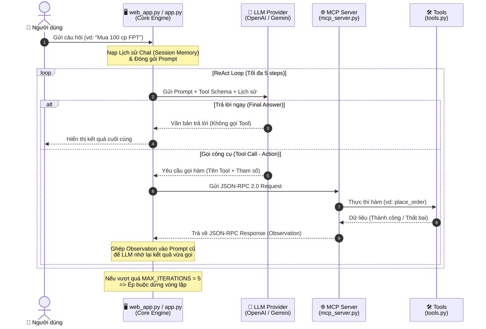

# Workflow: ReAct Agent tích hợp MCP Server

Sơ đồ dưới đây mô tả luồng hoạt động chi tiết của dự án, từ lúc người dùng đặt câu hỏi trên giao diện web/CLI cho đến lúc mô hình suy luận (ReAct) qua lại với các công cụ chứng khoán và trả về kết quả cuối cùng.

### 🧩 Các thành phần chính trong Workflow:

1. **Frontend / Core Engine (`web_app.py`, `app.py`)**: Đóng vai trò làm bộ não điều phối vòng lặp `while`. Nó quản lý số bước lặp (tối đa 5), nạp thêm ngữ cảnh lịch sử chat (Memory), và bọc kết quả từ công cụ trả về để mớm lại cho LLM.
2. **LLM Provider (`providers.py`)**: Tầng giao tiếp với OpenAI, Gemini, hoặc tự giả lập (Mock). Nhiệm vụ của LLM là đóng vai trò **"Tư duy" (Thought)**, quyết định xem lúc nào thì cần gọi công cụ (Action) và lúc nào thì đã đủ dữ liệu để trả lời khách hàng (Final Answer).
3. **MCP Server (`mcp_server.py`)**: Chuẩn hóa giao tiếp bằng chuẩn **JSON-RPC 2.0**. Dù có thay đổi hệ thống công cụ như thế nào, LLM cũng chỉ nói chuyện qua một kênh tiêu chuẩn duy nhất của MCP.
4. **Tools (`tools.py`)**: Các nghiệp vụ thực tế như tra cứu giá cổ phiếu (`fetch_stock_info`) hoặc đặt lệnh (`place_order`).
